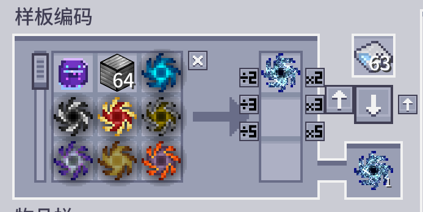
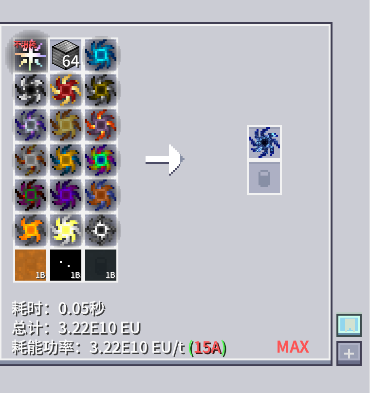

---
navigation:
  title: 虚拟物品系统
  parent: ae/index.md
  position: 50
categories:
  - gt_shanhai
  - ae2
item_ids:
  - gt_shanhai:virtual_item_provider
  - gt_shanhai:virtual_item_supply_machine
---

# 虚拟物品系统

* <ItemLink id="gt_shanhai:virtual_item_provider" />
* <ItemLink id="gt_shanhai:virtual_item_supply_machine" />

<Row gap="20">
<ItemImage id="gt_shanhai:virtual_item_provider" scale="4" />
<ItemImage id="gt_shanhai:virtual_item_supply_machine" scale="4" />
</Row>

## 说明

虚拟物品系统解决的是一个很具体的矛盾:配方摆明要求"用上某样东西",但那东西根本不该被吃掉。电路、模具、催化剂——这类只负责参与流程、自己不消耗的输入,不该逼你囤无限份,也不该占着仓库不放。

它由两部分组成:<ItemLink id="gt_shanhai:virtual_item_provider" /> 和 <ItemLink id="gt_shanhai:virtual_item_supply_machine" />。

<ItemLink id="gt_shanhai:virtual_item_provider" /> 是一枚"认物不认本体"的绑定道具。拿着它,另一只手放入目标物品,右键即可完成绑定;潜行右键清空绑定。绑定完成后它自己不会变成目标本体,但走进配方、样板、请求流程时,系统会把它当成目标本身来识别。电路、模具、催化剂、固定模板件——这类只需要"在场证明"而不需要真被吃掉的东西,交给它代表最合适。

<ItemLink id="gt_shanhai:virtual_item_supply_machine" /> 是这套系统接入 AE 网络的入口。把它接进网络后,槽位里放的真实物品就成了虚拟目标的下单校验源:网络因此愿意承认"这份真实库存,可以顶替那份虚拟需求"去发起合成,但绝不会把这批物品当成普通库存暴露出去,也不会被当仓储去存取。它只管"证明货在",不管"转运货物"。

一句话理清分工:要做"占位但不消耗"的自动化,先用提供器把目标绑好,再用供应机把真实物品接进网络背书;如果你要的只是普通仓储,这一组东西不是给你用的。

## AE 样板修改

编码后的样板与配方界面演示:

<Column gap="2" fullWidth={true}>

### 样板识别

> AE 样板编码时会主动识别 <ItemLink id="gt_shanhai:virtual_item_provider" />。\
> 样板里一旦出现已绑定的提供器,它就不再是"某个物品本体"的记录,而是那个目标的逻辑占位符。\
> 这正是虚拟物品系统的核心把戏:同一张样板看起来在消耗某样东西,实际只是在为目标"占坑",库存分毫不动。

</Column>

<Column gap="2" fullWidth={true}>

### 编码与执行

> 编码阶段,可虚拟化的非消耗输入会被自动改写成虚拟提供形式,不用你逐个手动绑定。\
> 执行阶段,系统先扫描样板里有没有虚拟提供器,把这些虚拟目标单独交给网络做下单校验。\
> 真正要被吃掉的输入,则原样走普通消耗逻辑,两条路径互不干扰,不会被混着处理。

</Column>

<Column gap="2" fullWidth={true}>

### 自动包裹规则

> 配方里的非消耗输入,默认会被尝试包裹成 <ItemLink id="gt_shanhai:virtual_item_provider" />。\
> 但像编程电路这类被列入排除名单的物品,会保留原样直接写入样板,不会被强行套上提供器的壳。\
> 这样两头都不吃亏:该占位不消耗的东西保住"占位"能力,该原样出现的物品也不会被改坏。

</Column>

<Column gap="2" fullWidth={true}>

### 非消耗流体(催化剂)

> 配方里的非消耗流体输入(比如反应用催化剂流体)会在编码时被自动识别为虚拟目标,只需要象征性的 1 mB 就能完成编码,不用绑定、也不经过 <ItemLink id="gt_shanhai:virtual_item_supply_machine" /> 校验。\
> 配方执行完成后,这部分虚拟标记会从样板缓存里原样剥离,不会占用真实流体存储。\
> 这是它和物品虚拟化的关键区别:流体这条路完全自动,不需要你额外准备任何道具。

</Column>

## 工作流

1. 先拿到一枚 <ItemLink id="gt_shanhai:virtual_item_provider" />。
2. 另一只手放入要代表的目标物品,右键完成绑定。
3. 把绑定好的提供器塞进需要识别它的配方、样板或输入环节。
4. 把对应的真实物品放进 <ItemLink id="gt_shanhai:virtual_item_supply_machine" />。
5. 供应机接入 AE 网络后,网络就能把这批真实物品当成虚拟提供的下单依据来校验。

## 适合场景

* 电路、模具、催化剂——这类不该被消耗的物品输入。
* 固定模板件、占位件、样板件——这类"必须在场才能下单"的物品。
* 反应类配方里的非消耗流体催化剂——不用管,系统自动虚拟化。
* 想让配方逻辑保留目标名义,但实际不走真实消耗的自动化产线。

## 需要注意

* <ItemLink id="gt_shanhai:virtual_item_provider" /> 不是目标物本体,它只是绑定载体,别指望拿它当正牌货用。
* <ItemLink id="gt_shanhai:virtual_item_supply_machine" /> 不是仓库,它只负责校验和背书下单来源,不接普通存取。
* 非消耗流体走的是配方自带的自动虚拟识别,不需要绑定提供器,也不经过供应机确认——别拿它和物品虚拟化的流程混着理解。
* 这套系统的目标从来不是替代仓储,而是让某些输入在逻辑上"存在",在库存上"分毫不扣"。
